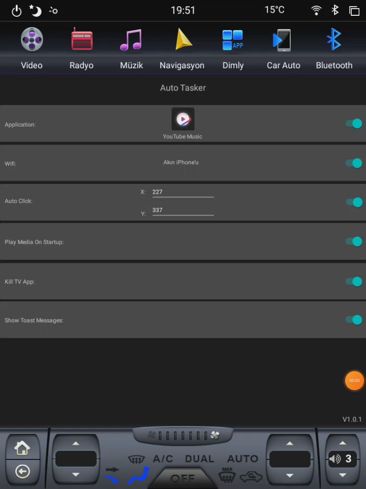
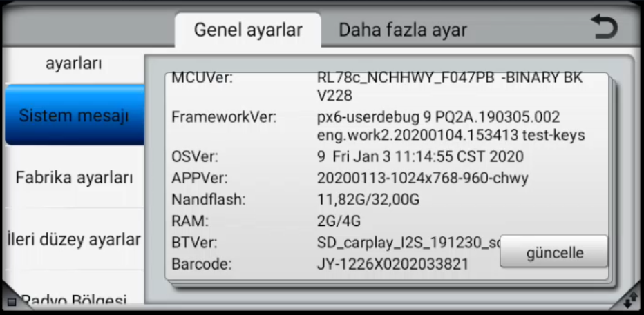

> **AutoTasker** is a Java-based Android application specially designed to automate various tasks in the multimedia system of the **Joying PX6** branded Android multimedia system compatible with [Opel Astra J](https://www.google.com/search?q=opel+astra+j+2013+hatchback&tbm=isch&ved=2ahUKEwib1N6k5MuCAxV8yQIHHZ5BDLYQ2-cCegQIABAA&oq=opel+astra+j+2013+hatchback&gs_lcp=CgNpbWcQAzIECAAQHlD2B1j2B2DtCWgAcAB4AIABeYgB4gGSAQMwLjKYAQCgAQGqAQtnd3Mtd2l6LWltZ8ABAQ&sclient=img&ei=_sBXZZvdD_ySi-gPnoOxsAs&bih=1291&biw=2560) model cars.
>
> The starting point of this application was my frustration with the fact that the multimedia system, which automatically starts every time I start my car, couldn't initiate the registered Wi-Fi connection. This led me to manually establish the Wi-Fi connection and became tired of manually opening and starting media applications like Youtube Music after the internet connection was established.

### Features

* **Automatic Internet Connection**: Ensure seamless connectivity to your phone's internet when your car is started.

* **Application Launch Automation**: Define and execute the launch of specific applications upon connecting to WiFi.

* **Automatic screen taps**: Simulate screen taps at designated coordinates when a specified application is in focus.

* **Automatic music playback**: Start playing music when you connect to your Wi-Fi network.

* **Automatically blocking the TV application**: It allows the automatic killing of the TV application that can suddenly open and cause music or video to stop due to an error in the operating system of the **Joying PX6** multimedia system

### Demo



In this demo, I turn off and on the hotspot connection on my phone, and AutoTasker automatically re-establishes the Wi-Fi connection, then immediately opens the Youtube Music application and clicks on the specified screen coordinates.

### Installation

To install AutoTasker application you should build on your local environment, follow these steps:

1. Clone the AutoTasker repository from GitHub.

    ```
    git clone https://github.com/Aknbb/AutoTasker.git
    ```
2. Open the AutoTasker project in Android Studio.

3. Build and run the project.

4. To build the project, click the Build button in the toolbar. To run the project, click the Run button in the toolbar.

Once the project is running, you can test the application on your device or an emulator.

Here are some additional instructions for developers:

* If you want to create a program that starts with the system on the **Joying PX6** system during boot, your application's artifact ID should start with **com.szchoiceway**. Programs starting with this artifact name are whitelisted and are not killed when the system wakes up from sleep mode. I discovered this through reverse engineering; the only alternative you can consider besides this method is to root the multimedia system, but it is **risky**.

* To add new features to the application, open the app/src/main/java/com/szchoiceway/autotasker directory.

* To change the application's appearance, open the app/src/main/res/ directory.

* To test the application on an emulator, click the Tools menu and select Android > AVD Manager.

### Usage

1- Install the APK.

2- Grant permissions to the application. 

3- Go to the Accessibility settings and turn on the AutoTasker Accessibility Service. 

4- The application will start automatically. You can enable or disable the desired features from the interface. 

5- Enjoy.

### My Car Multimedia System Info



####License
AutoTasker is licensed under the **MIT** License.

####Contact
Feel free to explore my AutoTasker project and get in touch if you have any questions or collaboration ideas. You can reach out to me via [akinbuyukbulut@gmail.com](mailto:akinbuyukbulut@gmail.com) or connect with me on [LinkedIn](https://www.linkedin.com/in/akinbuyukbulut/) and [GitHub](https://github.com/Aknbb).
